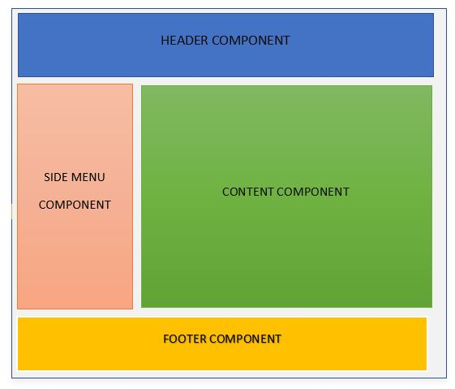
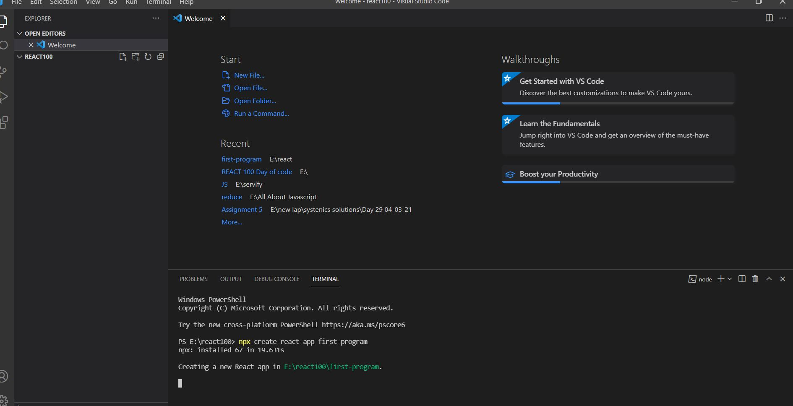

# React JS Tutorial

## Introduction 

- What is React?
    - It's an open source library for building user interface
    - Not a framwork
    - Focus on UI (point 2 and 3 says that react only focus on UI and does not focus on other part that framework do like routing sending https request etc.)
    - React has Rich ecosystem and plays really well with other librarys and is more of capable of building full web application

- Why to Learn React
    - Created and Maintained by facebook
    - since facebook uses react for their product and invest money it not gona die sooner
    - Huge Community
    - In demand skillset
    - Technical aspect of react
        - It component base architecture means every thing is divided in small components like header, footer, sidenav, main content

        

        - Ability to resue code using component for example :- one button can be use as signup in navbar same button can be use for add to cart option and so on by simply passing right data.
    - React is declarative
        - Tell React what you want and react will build the actual UI
        - Dom update are handle gracefully

## Geting started with React

`Install node from nodejs.org the latest released version and for text editor install vs code`

#### Create React app

- step1 : create folder in vscode 
- step2 : open terminal in vscode and write `npx create react app name-of-application(eg.facebook)`

- step3 : once done with creating switch to the folder of react that you have created (cd folder-name)

- step4 : start react app (npm start) 

Once done with all four step you will see the folder of react in that expand it and in src search App.js file and start editing and check the changes in browser


```js
import 'react' from 'REACT'; 
import './App.css';
function App() {
  return (
      <div>
        <h1>Hello world</h1>
      </div>
  )
}

```


