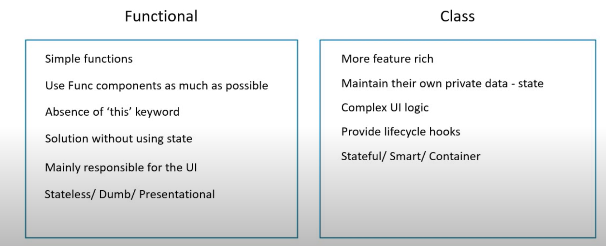

# Component in React

- In React Component represent the part of user interface
        <!--  -->


- In the above image we have five component 
    headers, sidenav, main content, footer and the main root component that contain many small component
- Component can contain another component
- Component can be reusable like in above example we have sidenav in left same sidenav can be use in right side

### Component in code

- Component code is saved in javascript or you can save in jsx file.
- what does that component looks like depends on the type of component we use.
- There are two type of component stateless Functional component and stateful class component.

|stateless functional component|stateful class component|
|-----|------|
|this are simply js file which return html| class component are simply es6 class which extend component react class and must contain render method which return HTML |

```js
//stateless functional component
    functional welcome(props){
        return <h1> Hello, {props.name}</h1>
    }
```

```js
//stateful class component

    class Welcome extends React.Component{
        render(){
            return <h1>hello, {this.props.name}</h1>
        }
    }
```


### Functional Component

- They are simply javascript function they can optionally receive props and return html that is JSX

`let's create a program in function component`

- step 1 :-  Create a folder name component and in that create a js file


- step 2 :- In Greet.js file import react and then create a function and export it so that it can be using within the application

```js
import React from 'react'

function Greet() {
    return (
        <div>
            Hello prasad
        </div>
    )
}

export default Greet
```

step 3 :- In App.js import the Greet.js file and add the component that you want to render

```js
import logo from './logo.svg';
import './App.css';
import Greet from './Component/Greet';

function App() {
  return (
    <div className="App">
      <Greet />  {/*Greet component*/}
    </div>
  );
}

export default App;

```
output: 


`Note:- If you are using default export i.e export default ComponentName then while importing in other file you can change the name and use it. But if you are using name export i.e export as a prefix to function then you have to use the exact same name while importing.`

```js

//Default export
import React from 'react'

function Greet() {
    return (
        <div>
            Hello prasad
        </div>
    )
}

export default Greet
//end of default export

//while importing default export
import logo from './logo.svg';
import './App.css';
import MyComponent from './Component/Greet';

function App() {
  return (
    <div className="App">
      <MyComponent />  {/*Greet component*/}
    </div>
  );
}

export default App;
//Name export

import React from 'react'

export function Greet() {
    return (
        <div>
            Hello prasad
        </div>
    )
}
//End of name export

//While importing name export

import logo from './logo.svg';
import './App.css';
import { Greet } from './Component/Greet';

function App() {
  return (
    <div className="App">
      <Greet />  {/*Greet component*/}
    </div>
  );
}

export default App;
```

### Class Component

- Class Component are basically es6 classes.
- Simillar to functional component they receive props as input and return HTML(jsx)
- Apart from this class component maintain `private internal state` that is they maintain a private information that can be used on by that component.


`steps to create class component`

```js
import React, {Component} from 'react' //We need to import two things while creating class that is react and component

//step:1- To make the class react component we need to extend component class from react
class Welcome extend Component{     
render(){      //class should return something that will be done by render method
  return <h1>Hello</h1>
}
}
export default Welcome

//import this in App.js as done for functional you are done with class component
```

#### Difference between functional and Class Components





