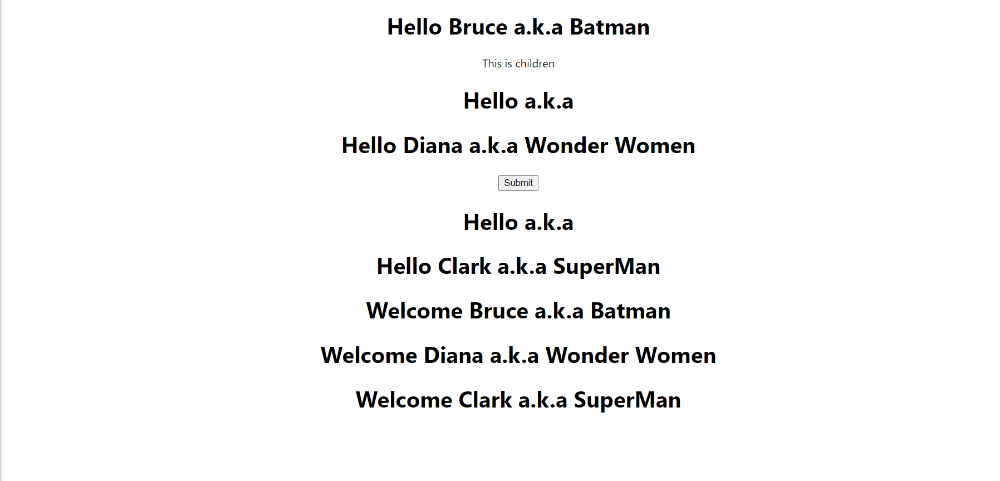

# Props

- As Discussed Earlier Components are reusable.
- Same component by use multiple time using different properties.
- Props short for properties is optional input that your component can accept. It also allows component to be dynamics.
-`Props are immutable means cannot change its value`


### We will discuss below

### Props for Functional Component

- we need to pass props parameter in function.
- Our intension here is to pass the props from app.js to greet.js 
- We are greeting 3 different people at the same time

```js
//App.js
import './App.css';
import Greet from './Component/Greet';

function App() {
  return (
    <div className="App">
      <Greet name="Bruce"/>
      <Greet name="Diana"/>
      <Greet name="Clark"/>
    </div>
  );
}

export default App;
```
```js
//Greet.js

import React from 'react'

function Greet(props) {
    return (
        <div>
            Hello {props.name}
        </div>
    )
}

export default Greet
```


- Another way you can pass multiple props in one elements and can also render children

```js
//App.js

//import logo from './logo.svg';
import './App.css';
import Greet from './Component/Greet';

function App() {
  return (
    <div className="App">
      <Greet name="Bruce" superHeroname="Batman"/>
      This is children
      <Greet/>
      <Greet name="Diana" superHeroname="Wonder Women"/>
      <button>Submit</button>
      <Greet />
      <Greet name="Clark" superHeroname="SuperMan"/>
    </div>
  );
}

export default App;
```


```js
//Greet.js

import React from 'react'

function Greet(props) {
    return (
        <div>
            <h1>Hello {props.name} a.k.a {props.superHeroname}</h1>
            {props.children}
        </div>
    )
}

export default Greet
```


### Props for Class Component

- In class component properties are reserved keywords that can be accessed by `this.props` keywords

```js
//import logo from './logo.svg';
import './App.css';
import Greet from './Component/Greet';
import Welcome from './Component/Welcome';

function App() {
  return (
    <div className="App">
      <Greet name="Bruce" superHeroname="Batman"/>
      This is children
      <Greet/>
      <Greet name="Diana" superHeroname="Wonder Women"/>
      <button>Submit</button>
      <Greet />
      <Greet name="Clark" superHeroname="SuperMan"/>

        <!--Class Component-->
      <Welcome name="Bruce" superHeroname="Batman"/>
      <Welcome name="Diana" superHeroname="Wonder Women"/>
      <Welcome name="Clark" superHeroname="SuperMan"/>

    </div>
  );
}

export default App;

```

```js
//Class welcome component
import React, { Component } from 'react'

 class Welcome extends Component {

    render() {
        return (
            <div>
                <h1>Welcome {this.props.name} a.k.a {this.props.superHeroname}</h1>
            </div>
        )
    }
}

export default Welcome

```
